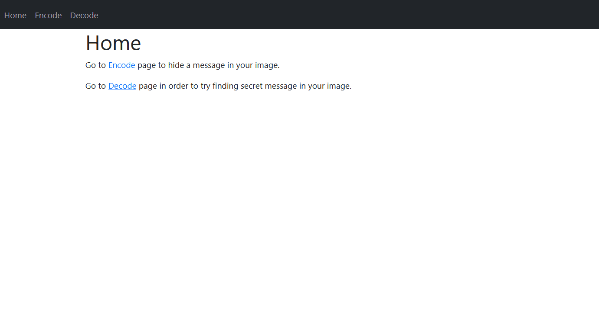

# Steganography Flask app

<p float="left">


</p>


#### Basic steganography app able to hide text message in an image, created as a part of Cryptography classes.

<p align="center">    
</p>


Run with:
```python
    python app.py 
```

- encrypting message by hiding its bits in RGB red value bytes (to be specific: last, eight bit)
- user able to upload picture of his own choice
- user able to decrypt image

#### Still under developement. TODOs:

- all photo file formats handling (for now, only PNG is tested and works)
- encrypting cleartext before hiding it in image with various algorithms
- perhaps some tweaks to visuals

#### Used technologies:

- Flash / Python
- Bootstrap
- Pillow
- JetBrains PyCharm

Special thanks to Mr. Dave Briccetti, YouTube tutorial made by him was most helpful, and some of his code was used in this project (for example, bits_provider generator). Link to tutorial: https://www.youtube.com/watch?v=dD6wl8zrM60.

# 

Mateusz Safaryjski / MatSaf123 / 2021